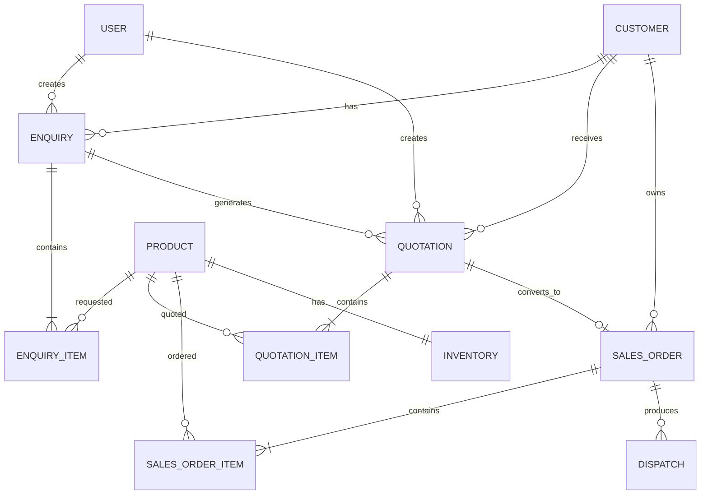

# ERP Management System — Entity Relationship Diagram

## Core relationships

- One **Customer** can have many Enquiries, Quotations, and Sales Orders.
- One **Enquiry** contains many Enquiry Items; each item references one Product.
- One **Enquiry** can generate Quotations.
- One **Quotation** contains many Quotation Items; each item references one Product.
- A **Quotation** can generate at most one Sales Order because `SalesOrder.quotationId` is unique.
- One **Sales Order** contains many Sales Order Items; each item references one Product.
- Each **Product** has one Inventory record containing physical and reserved quantities.
- A **Sales Order** can have Dispatch records in the database; the backend workflow prevents duplicate dispatch for the same order.
- User-created records retain the creating user's ID where supported by the schema.

## Workflow represented by the database

**Customer → Enquiry → Quotation → Sales Order → Inventory Reservation → Dispatch**

Inventory availability is calculated as:

`Available Quantity = Physical Quantity - Reserved Quantity`

Reservation occurs when an Admin confirms a Sales Order. Dispatch later decreases both physical and reserved quantities.
